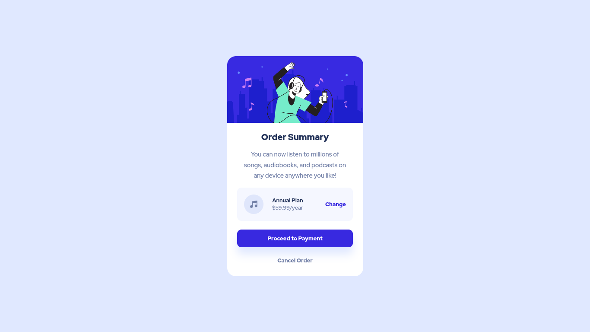

# Frontend Mentor - Order summary card solution

This is a solution to the [Order summary card challenge on Frontend Mentor](https://www.frontendmentor.io/challenges/order-summary-component-QlPmajDUj). Frontend Mentor challenges help you improve your coding skills by building realistic projects. 

## Table of contents

  - [Overview](#overview)
    - [Screenshot](#screenshot)
    - [Links](#links)
  - [My process](#my-process)
    - [Built with](#built-with)
    - [What I learned](#what-i-learned)
    - [Continued development](#continued-development)
  - [Author](#author)
  
## Overview

### Screenshot

Desktop Design:



Mobile Design:


### Links

- [Solution URL](https://github.com/reza-sjdn/order-summary-component)
- [Live Demo](https://reza-sjdn.github.io/order-summary-component/)


## My process

### Built with

- Semantic HTML5 markup
- CSS custom properties
- Flexbox
- Mobile-first workflow


### What I learned

A typical practice to center the main container in the body.
This repeats very often in frontend mentor challenges.

```css
body {
  display: flex;
  justify-content: center;
  align-items: center;
  min-height: 100vh;
}

.container {
  height: 100%;
}
```


### Continued development

I gotta learn more about box shadows!


## Author

- Frontend Mentor - [@reza-sjdn](https://www.frontendmentor.io/profile/reza-sjdn)
- Twitter - [@reza_sjdn](https://www.twitter.com/reza_sjdn)
- Telegram - [@reza_sjdn80]
